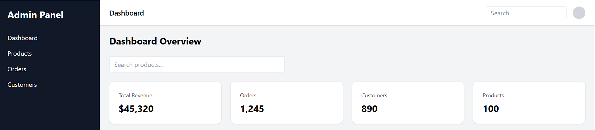
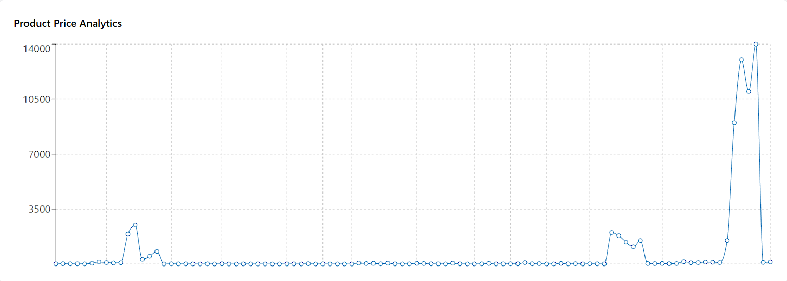
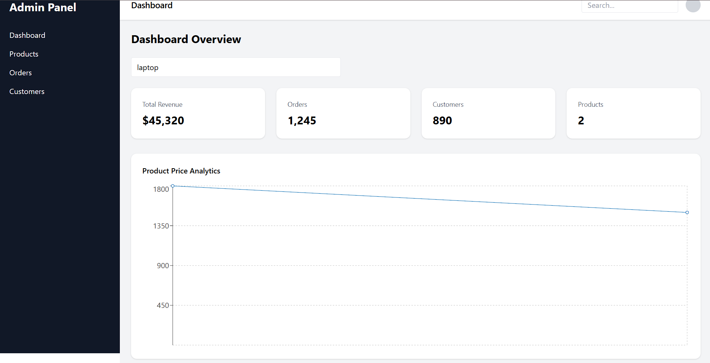

# 🚀 AI-Powered E-Commerce Dashboard

A modern analytics dashboard built using **React, TypeScript, and Tailwind CSS** to visualize e-commerce data with high performance and scalable frontend architecture.

🌐 **Live Demo:** https://ai-ecommerce-dashboard-mj75.vercel.app  
💻 **GitHub Repository:** https://github.com/Sudeep259/ai-ecommerce-dashboard

---

## ✨ Features

- 📊 Interactive analytics dashboard
- ⚡ Real-time product search with debouncing
- 🚀 Virtual scrolling for large datasets
- 🔄 REST API integration with caching
- 📱 Fully responsive layout
- 🧩 Atomic design component architecture
- ♿ Accessibility-friendly UI
- ⚡ Optimized performance with lazy loading

---

## 🛠 Tech Stack

### Frontend
- React.js
- TypeScript
- Tailwind CSS
- Vite

### Data & Visualization
- Recharts
- Axios (API integration)

### Performance Optimization
- Debounced search
- Virtualized lists (react-window)
- LocalStorage caching
- Code splitting & lazy loading

### Deployment
- Vercel

---

## 📂 Project Structure
src/
│
├── components/
│ ├── atoms/
│ └── organisms/
│
├── layouts/
├── pages/
├── hooks/
├── services/
└── assets/

---

## ⚙️ Installation & Setup

Clone the repository:

```bash
git clone https://github.com/Sudeep259/ai-ecommerce-dashboard.git
Navigate into project:
cd ai-ecommerce-dashboard
Install dependencies:

npm install
Run development server:

npm run dev

Open:

http://localhost:5173
🧠 Performance Highlights

Reduced unnecessary renders using debounced search

Implemented virtual scrolling for handling large product datasets

Client-side caching reduced API calls

Optimized bundle loading using Vite

📸 Preview

## 📸 Application Preview

### Dashboard


### Analytics Chart


### Product Search


👨‍💻 Author

Sudeep Kumar

GitHub: https://github.com/Sudeep259


⭐ If you like this project

Give it a ⭐ on GitHub!

---

